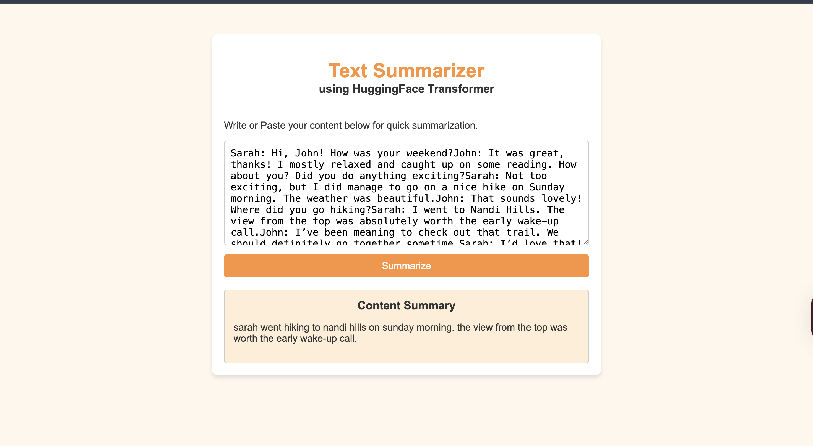

# 📝 AI Text Summarizer

An AI-powered abstractive text summarization web application built using the T5 Transformer model. The application generates concise and meaningful summaries from long-form text through a FastAPI backend and a simple HTML frontend.

---

## 🚀 Features

- Generate abstractive summaries using Google's T5 Transformer
- FastAPI backend for efficient inference
- Clean and responsive HTML interface
- Automatic text preprocessing
- Supports long-form text summarization
- Uses GPU (CUDA/MPS) when available for faster inference

---

## 🛠️ Tech Stack

### Languages
- Python
- HTML

### Frameworks & Libraries
- FastAPI
- Hugging Face Transformers
- PyTorch
- Pydantic

### Model
- T5 (Text-To-Text Transfer Transformer)

---

## 📂 Project Structure

```
AI-Text-Summarizer/
│
├── app.py                     # FastAPI backend
├── index.html                 # Frontend UI
├── requirements.txt
├── README.md
├── .gitignore
├── .gitattributes
│
└── saved_summary_model/
    ├── config.json
    ├── generation_config.json
    ├── model.safetensors
    ├── tokenizer.json
    └── tokenizer_config.json
```

---

## ⚙️ Installation

### 1. Clone the repository

```bash
git clone https://github.com/yourusername/ai-text-summarizer.git
cd ai-text-summarizer
```

### 2. Create a virtual environment (Optional)

```bash
python -m venv venv
```

Activate it:

Windows

```bash
venv\Scripts\activate
```

macOS/Linux

```bash
source venv/bin/activate
```

---

### 3. Install dependencies

```bash
pip install -r requirements.txt
```

---

### 4. Run the application

```bash
uvicorn app:app --reload
```

Open your browser and visit

```
http://127.0.0.1:8000
```

---

## 📌 API Endpoint

### Summarize Text

**POST**

```
/summarize/
```

### Request Body

```json
{
  "dialogue": "Enter your long text here..."
}
```

### Response

```json
{
  "summary": "Generated summary..."
}
```

---

## 🧠 Model Details

- Transformer: T5
- Framework: Hugging Face Transformers
- Backend: PyTorch
- Inference Device:
  - Apple Silicon (MPS)
  - CUDA GPU
  - CPU

---

## 📊 Workflow

```
Input Text
      │
      ▼
Text Preprocessing
      │
      ▼
Tokenization
      │
      ▼
T5 Transformer
      │
      ▼
Generated Summary
      │
      ▼
Display Output
```

---

## 📷 Screenshots



## 🔮 Future Improvements

- Upload PDF/DOCX files
- Multi-language summarization
- Adjustable summary length
- Deploy using Hugging Face Spaces or Render
- User authentication
- Batch summarization

---

